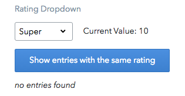

The UI Extensions SDK allows you to customize and extend the functionality of Contentful Web Application's entry editor. The editor itself is a container for many "widgets" that enable editors to manipulate the content stored in content fields. Widgets' complexity varies. They can be simple user interface controls, such as a dropdown, or more complex micro web applications such as our Markdown editor. They are decoupled entities from field types, and can be reused (for example using a dropdown widget to edit number or text fields).

Previously, the Contentful Web Application only offered our core platform widgets as options to manipulate fields' content. Now, with the UI Extensions SDK it is possible to create custom widgets to further personalize your users' needs. Core widgets and custom widgets are both built on top of the same API, making them virtually identical in functionality with the main difference being that custom widgets are rendered inside a secure iframe.

## Examples

### Basic rating dropdown
Basic widget that helps you get started with developing. Uses a dropdown to change the value of a number field and makes some CMA requests. 
[View on GitHub](https://github.com/contentful/widget-sdk/tree/master/examples/rating-dropdown)

### Rich text editor
This example integrates the Alloy rich text editor to edit text fields. 
[View on GitHub](https://github.com/contentful/widget-sdk/tree/master/examples/alloy-editor)

### Chessboard
This widget displays a chessboard and stores the board position as a JSON object. You can drag pieces on the chessboard and the position data will be updated automatically. The widget also supports collaborative editing. If two editors open the same entry moves will be synced between them. 
[View on GitHub](https://github.com/contentful/widget-sdk/tree/master/examples/chessboard)

### Slug generator
This widget will automatically generate its values from an entries title field. For example typing “Hello World” into the title field will set the widgets input field to “hello-world”. It will also check the uniqueness of the slug across a customizable list of content types. 
[View on GitHub](https://github.com/contentful/widget-sdk/tree/master/examples/slug)

### Translator
This widget translates text from the default locale to other locales in a space using the Yandex translation API. 
[View on GitHub](https://github.com/contentful/widget-sdk/tree/master/examples/translate)

### JSON editor
This widget provides a JSON formatter and validator based on the CodeMirror library. 
It should be used with fields with the type “Object”. 
[View on GitHub](https://github.com/contentful/widget-sdk/tree/master/examples/json-editor)

### JSON form editor
This widget integrates the JSON editor library to display an edit form based on a predefined JSON schema. Form input gets stored as a JSON object. 
[View on GitHub](https://github.com/contentful/widget-sdk/tree/master/examples/json-form-editor)
